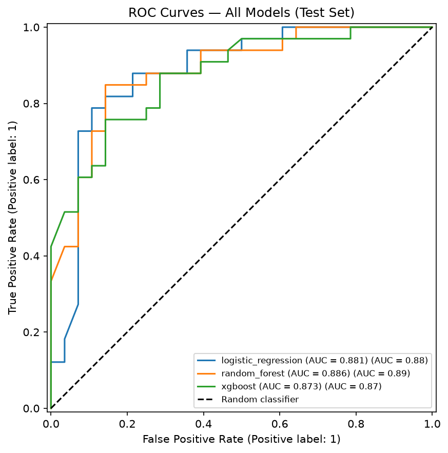
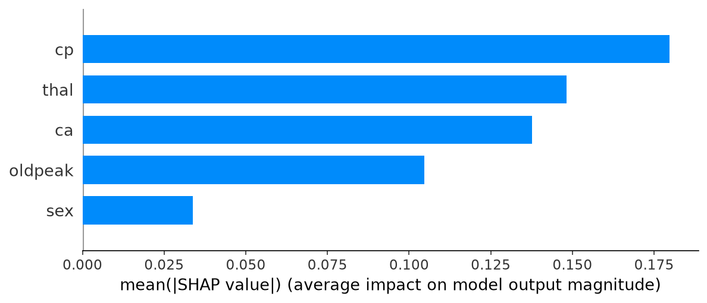
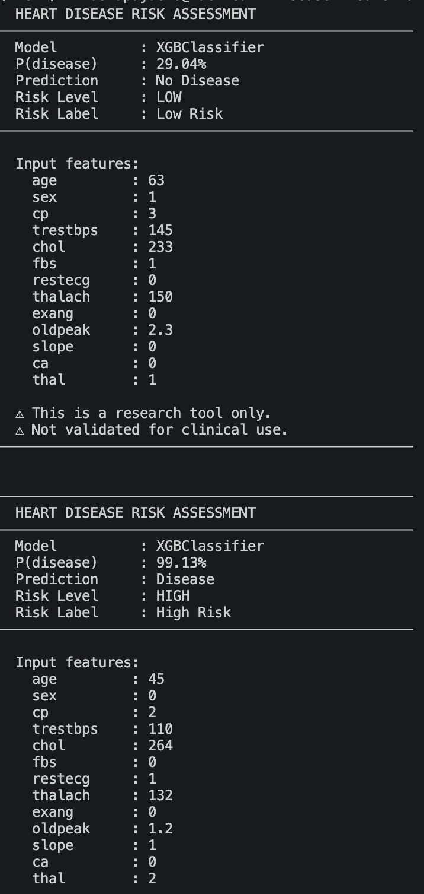

# Heart Disease Risk Prediction with Machine Learning

> End-to-end machine learning project for predicting heart disease risk using clinical patient data.  
> Built to demonstrate ML engineering practices: data validation, leakage prevention, feature engineering, model comparison, explainability, and reproducible pipelines.


---

## 1. Project Summary

This project predicts whether a patient is likely to have heart disease using clinical measurements from the Kaggle/UCI Heart Disease dataset.

The goal was not only to train a high-performing model, but to build a complete ML workflow that follows real-world engineering practices:

- Clean and modular project structure
- Train/validation/test split before preprocessing
- Feature engineering using clinical reasoning
- Multiple model comparison
- Cross-validation and generalization gap analysis
- SHAP-based explainability
- Reusable source code and testing structure

---

## 2. Business / Clinical Problem

Heart disease is one of the leading causes of death worldwide. Early identification of high-risk patients can support better screening and preventive care.

This project frames the task as a binary classification problem:

| Target | Meaning |
|---|---|
| `0` | No heart disease |
| `1` | Heart disease |

Because this is a health-related prediction problem, **recall** is especially important. Missing a patient with heart disease can be more harmful than incorrectly flagging a healthy patient.

---

## 3. Dataset

**Source:** [Kaggle Heart Disease Dataset](https://www.kaggle.com/datasets/johnsmith88/heart-disease-dataset)

The dataset contains clinical variables such as:

| Feature | Description |
|---|---|
| `age` | Patient age |
| `sex` | Biological sex |
| `cp` | Chest pain type |
| `trestbps` | Resting blood pressure |
| `chol` | Serum cholesterol |
| `thalach` | Maximum heart rate achieved |
| `exang` | Exercise-induced angina |
| `oldpeak` | ST depression induced by exercise |
| `ca` | Number of major vessels |
| `thal` | Thalassemia result |
| `slope` | Slope of peak exercise ST segment |

---

## 4. Machine Learning Workflow

```text
Raw Data
   ↓
Exploratory Data Analysis
   ↓
Train / Validation / Test Split
   ↓
Preprocessing
   ↓
Feature Engineering
   ↓
Model Training
   ↓
Model Evaluation
   ↓
SHAP Explainability
   ↓
Final Model Selection
```

---

## 5. Project Structure

```text
.
├── data/
│   ├── raw/
│   └── processed/
│
├── notebooks/
│   ├── 01_eda.ipynb
│   ├── 02_preprocessing.ipynb
│   ├── 03_modeling.ipynb
│   └── 04_explainability.ipynb
│
├── src/
│   ├── data/
│   │   ├── load_data.py
│   │   ├── preprocess.py
│   │   └── split_data.py
│   │
│   ├── features/
│   │   └── build_features.py
│   │
│   ├── models/
│   │   ├── train.py
│   │   ├── predict.py
│   │   ├── evaluate.py
│   │   └── explain.py
│   │
│   ├── visualization/
│   │   └── plots.py
│   │
│   └── utils/
│       ├── config.py
│       └── helpers.py
│
├── models/
│   ├── best_model.pkl
│   └── preprocessor.pkl
│
├── configs/
│   ├── model_config.yaml
│  
├── requirements.txt
├── inference.py
├── README.md
└── .gitignore
```

---

## 6. Feature Engineering

Three engineered features were created to capture clinical patterns beyond the raw dataset.


### Ischemia Score

```python
isquemia_score = oldpeak + exang + (ca / 3)
```

Combines multiple indicators of cardiac stress.

### Estimated Stroke Volume Proxy

```python
est_stroke_volume = (trestbps / thalach) * (age / 50)
```

Approximates cardiovascular efficiency under stress.

These features were evaluated using Correlation analysis, Multicollinearity check, Variance inflation factor (VIF) and Ablation tests.

---

## 7. Models Evaluated

The following models were trained and compared:

| Model | Why it was included |
|---|---|
| Logistic Regression | Strong baseline and interpretable linear model |
| Random Forest | Non-linear ensemble model |
| XGBoost | Gradient boosting model with strong tabular performance |

---

## 8. Results



| Model | Accuracy | ROC-AUC | Recall | Precision | F1 | CV Gap |
|---|---:|---:|---:|---:|---:|---:|
| **XGBoost** | **81.97%** | **0.894** | 0.788 | 0.867 | 0.825 | 0.050 |
| Logistic Regression | 81.97% | 0.889 | 0.788 | 0.867 | 0.825 | 0.045 |
| Random Forest | 81.97% | 0.875 | 0.818 | 0.844 | 0.831 | 0.063 |

### Final Model Selected: XGBoost

XGBoost was selected because it achieved the strongest ROC-AUC while maintaining an acceptable generalization gap.

---

## 9. Confusion Matrix

```text
Confusion Matrix — XGBoost Test Set

                  Predicted No Disease   Predicted Disease
Actual No Disease        TN = 24              FP = 4
Actual Disease           FN = 7               TP = 26
```

### Clinical Interpretation

The model correctly identified **26 out of 33 patients with heart disease**, achieving a recall of **78.8%**.

However, the model missed **7 positive cases**, which is an important limitation in a healthcare screening context.

---

## 10. Engineering Decisions

### Leakage Prevention

The dataset was split before preprocessing or feature engineering.

This prevents information from the validation or test sets from influencing imputation, scaling, or transformation logic.


```python
X_train, X_val, X_test, y_train, y_val, y_test = split_data(df)

X_train_processed, X_val_processed, X_test_processed, preprocessor = preprocess(
    X_train,
    X_val,
    X_test
)
```

### Generalization Gap Analysis

Model performance was evaluated using both cross-validation and test performance.

```text
XGBoost:             CV=0.944  Test=0.894  Gap=0.050
Random Forest:       CV=0.938  Test=0.875  Gap=0.063
Logistic Regression: CV=0.933  Test=0.889  Gap=0.045
```

Random Forest showed a larger gap, suggesting possible overfitting.

### Feature Selection

Feature selection was based on:

1. Correlation with target
2. Feature-feature redundancy
3. Ablation testing
4. SHAP importance

This helped remove redundant features and validate that engineered features added predictive value.

---

## 11. Explainability with SHAP

SHAP was used to understand which features influenced model predictions.



| Feature | SHAP Importance | Interpretation |
|---|---:|---|
| `cp` | 22.5% | Chest pain type was the strongest signal |
| `isquemia_score` | 17.6% | Engineered ischemia feature added meaningful signal |
| `est_stroke_volume` | 15.1% | Captured non-linear cardiovascular efficiency |
| `thal` | 13.7% | Important clinical diagnostic feature |
| `sex` | 8.8% | Contributed to model predictions |
| `slope` | 6.5% | ST segment pattern contributed predictive value |

The engineered features ranked among the top predictors, validating the feature engineering strategy.

---

## 12. Key ML Engineering Skills Demonstrated



**Counterintuitive feature behavior:** `isquemia_score` has a negative
correlation with the target (-0.637), meaning higher composite ischemia 
scores correlate with *lower* disease probability in this dataset. This 
likely reflects selection bias in the Cleveland cohort — patients with 
known severe ischemia may have been filtered before enrollment. 
This is a known limitation of the dataset, not a modeling error.

---

## 13. Key ML Engineering Skills Demonstrated

This project demonstrates my ability to:

- Build a complete supervised ML pipeline
- Prevent data leakage
- Compare baseline and advanced models
- Engineer domain-inspired features
- Evaluate models using business-relevant metrics
- Use cross-validation to assess stability
- Interpret models with SHAP
- Structure ML code for reproducibility
- Separate notebooks from reusable production-style modules
- Communicate model limitations clearly

---

## 14. Limitations

This project is based on a small dataset, so the results should not be interpreted as clinically deployable.

Known limitations:

- Small sample size
- Limited demographic information
- No external validation dataset
- False negatives remain a concern
- Engineered clinical proxies require further validation

Future improvements could include:

- Hyperparameter tuning with Optuna
- Model calibration
- Additional external validation
- FastAPI inference endpoint
- Dockerized deployment
- CI/CD testing pipeline

---

## 15. Tech Stack

| Category | Tools |
|---|---|
| Language | Python |
| Data Processing | pandas, NumPy |
| Machine Learning | scikit-learn, XGBoost |
| Explainability | SHAP |
| Visualization | Matplotlib, Seaborn |
| Testing | pytest |
| Project Structure | Modular Python package |

---

## 16. How to Run the Project

### Clone the repository

```bash
git clone https://github.com/your-username/heart-disease-ml.git
cd heart-disease-ml
```

### Create a virtual environment

```bash
python -m venv venv
source venv/bin/activate
```

### Install dependencies

```bash
pip install -r requirements.txt
```

### Train the model

```bash
python src/models/train.py
```

### Run tests

```bash
pytest
```

---

## 17. Author

**Jhoselyn Miluska Pajuelo**  
Software Engineer transitioning into AI/ML Engineering  

**Dr. Morgan Carson-Marino**  
Scientist and Pharmacist at University of Utah

Focused on building reliable, explainable, and user-centered machine learning systems.